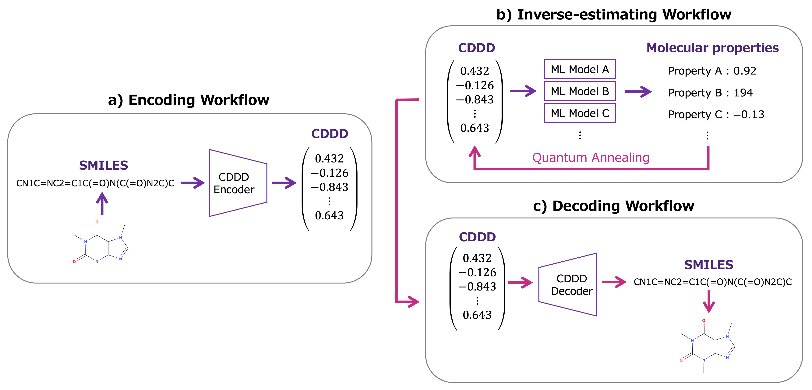

# Quantum annealing molecular inverse design

Implementation of the paper [_"Inverse design of desired molecules by quantum annealing with machine learning based scalable generator"_](INPUT_LINK) by Yuki Deguchi and Masato Taki.

If you are using the code in your research, please cite the corresponding publication:

Y. Deguchi and M. Taki. 
Inverse design of desired molecules by quantum annealing with machine learning based scalable generator. 
XXXXX, XX, XXX (20XX). LINK

    @Article{INPUT,
        author={Deguchi, Yuki and Taki, Masato},
        title={Inverse design of desired molecules by quantum annealing with machine learning based scalable generator},
        journal={INPUT},
        year={INPUT},
        volume={INPUT},
        number={INPUT},
        pages={INPUT},
        issn={INPUT},
        doi={INPUT},
        url={INPUT},
    }

The code provided in this repository allows to collect molecular data from ZINC-221, preprocess the collected data, train the molecular property prediction models and generate molecules from the specified property values. 

Note that the code includes the source published in SAS2 and CDDD3 papers without modification in the directory [_external_lib_](https://github.com/hijooguchi/qa_molecular_inverse_design/main/external_lib).

We also provide data of the molecules generated by the method proposed in the paper and their property values. Please refer to the directory [_published_data_](https://github.com/hijooguchi/qa_molecular_inverse_design/main/published_data).

### Requirements
- python >= 3.6
- dwave-neal >= 0.5.9
- dwave-system >= 1.12.0
- numpy >= 1.19.5
- rdkit-pypi >= 2021.3.1.5
- scikit-learn >= 0.24.2
- tensorflow == 1.10.0

### Recommended environments
- Ubuntu >= 22.04
- Docker >= 24.0

The following command will create and execute a new container named “qa_mid”:

    docker compose up -d
    docker container exec -it qa_mid bash

Note that you should edit [_compose.yml_](https://github.com/hijooguchi/qa_molecular_inverse_design/main/compose.yml) according to your environment.

# Getting started

Clone the repository into your directory of choice:

    git clone https://github.com/hijooguchi/qa_molecular_inverse_design.git

### Correct and preprocess molecular data

The training data for the molecular property prediction models can be any molecular data. 
When using ZINC-22 dataset, the following commands will collect the data:

    cd dataset
    bash download_zinc22_dataset.sh
    cd ../

And preprocess the collected data:

    bash rawdata_preprocess.sh

### Train molecular property prediction model

The proposed method generates molecules based on the parameters of molecular property prediction models. 
These models are trained using molecular descriptors called CDDD proposed by Winter _et al._3
To calculate CDDD, please download a pre-trained model from [_CDDD repository_](https://github.com/jrwnter/cddd/tree/master) or train it yourself, and save it in directory [_external_lib/cddd/data/default_model_](https://github.com/hijooguchi/qa_molecular_inverse_design/main/external_lib/cddd/data/default_model).

The following commands will calculate the seven properties and CDDD of molecules for training:

    bash get_props.sh

The seven properties are as follows:
- QED4
- SAS2
- log _P_
- Molecular weight
- TPSA5
- Number of hydrogen bond acceptors
- Number of hydrogen bond donors
- Number of rotatable bonds
- Number of aromatic rings

And train the molecular property prediction models:

    bash train_prop_model.sh

You can also use other molecular properties as training data if you modify the code.

### Generate molecules from property values

