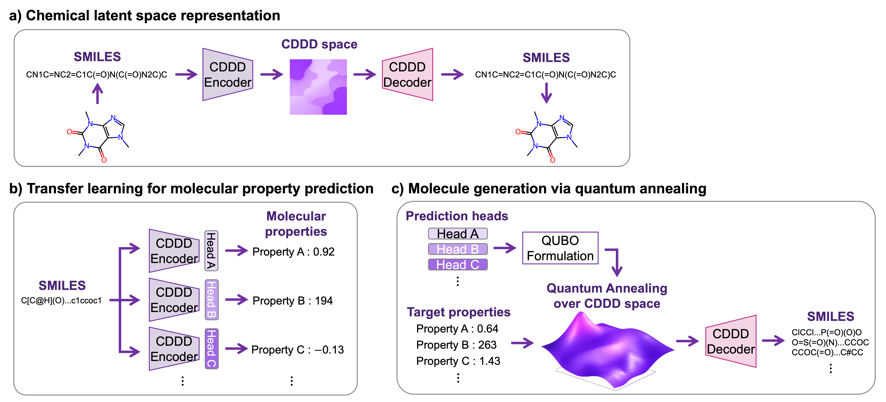

# Quantum annealing molecular inverse design

Implementation of the paper [_"A property–agnostic framework for scalable molecular inverse design via quantum annealing"_](https://doi.org/10.1039/D6DD00012F) by Yuki Deguchi and Masato Taki.

If you are using the code in your research, please cite the corresponding publication:

Y. Deguchi and M. Taki. 
A property–agnostic framework for scalable molecular inverse design via quantum annealing. 
*Digital Discovery* (2026). http://dx.doi.org/10.1039/D6DD00012F

    @Article{D6DD00012F,
        author="Deguchi, Yuki and Taki, Masato",
        title="A property–agnostic framework for scalable molecular inverse design via quantum annealing",
        journal="Digital Discovery",
        year="2026",
        pages="-",
        publisher="RSC",
        doi="10.1039/D6DD00012F",
        url="http://dx.doi.org/10.1039/D6DD00012F",
        abstract  ="Technologies for designing molecules with desired properties have the potential to drive innovation across a wide range of fields. Molecular inverse design typically involves three key tasks: chemical latent space representation{,} property prediction{,} and molecule generation. While deep learning models trained on large molecule-property datasets can address all three tasks within a unified framework{,} they often require substantial property-specific retraining when targeting new molecular properties{,} limiting scalability. In this work{,} we propose an algorithmic framework that integrates machine learning and quantum annealing by explicitly decoupling chemical latent space representation{,} property prediction{,} and molecule generation. By freezing deep molecular representations learned from large datasets and separating molecule generation from deep learning{,} the proposed method enables inverse design for new target properties at a low training cost{,} requiring only lightweight model adaptation. Using quantum annealing{,} 98% of the generated molecules were novel and exhibited properties close to the desired targets{,} indicating efficient exploration beyond the training distribution. Moreover{,} the molecular generation rate was approximately six times faster than that of classical optimization algorithms. These results demonstrate that modularizing molecular inverse design into complementary learning and optimization components provides a scalable and effective alternative to monolithic deep learning-based approaches."
    }

The code provided in this repository allows to collect molecular data from ZINC-221, preprocess the collected data, train the molecular property prediction models and generate molecules from the specified property values. 

Note that the code includes the source published in SAS2 and CDDD3 papers without modification in the directory [_external_lib_](./external_lib).

We also provide data of the molecules generated by the method proposed in the paper and their property values. Please refer to the directory [_published_data_](./published_data).

### Requirements
- python >= 3.6
- dwave-neal >= 0.5.9
- dwave-system >= 1.12.0
- numpy >= 1.19.5
- rdkit-pypi >= 2021.3.1.5
- scikit-learn >= 0.24.2
- tensorflow == 1.10.0

### Recommended environments
- Ubuntu >= 22.04
- Docker >= 24.0

The following command will create and execute a new container named "qa_mid":

    docker compose up -d
    docker container exec -it qa_mid bash

Note that you should edit [_compose.yml_](./compose.yml) according to your environment.

# Getting started

Clone the repository into your directory of choice:

    git clone https://github.com/hijooguchi/qa_molecular_inverse_design.git

### Correct and preprocess molecular data

The training data for the molecular property prediction models can be any molecular data. 
When using ZINC-22 dataset, the following commands will collect the data:

    cd dataset
    bash download_zinc22_dataset.sh
    cd ../

And preprocess the collected data:

    bash rawdata_preprocess.sh

### Train molecular property prediction model

The proposed method generates molecules based on the parameters of molecular property prediction models. 
These models are trained using molecular descriptors called CDDD proposed by Winter _et al._3
To calculate CDDD, please download a pre-trained model from [_CDDD repository_](https://github.com/jrwnter/cddd/tree/master) or train it yourself, and save it in the directory [_external_lib/cddd/data/default_model_](./external_lib/cddd/data/default_model).

The following commands will calculate the seven properties and CDDD of molecules for training:

    bash get_props.sh

The seven properties are as follows:
- QED4
- SAS2
- log _P_
- Molecular weight
- TPSA5
- Number of hydrogen bond acceptors
- Number of hydrogen bond donors
- Number of rotatable bonds
- Number of aromatic rings

And train the molecular property prediction models:

    bash train_prop_model.sh

You can also use other molecular properties as the training data if you modify the code.

### Generate molecules from property values

You can choose any number of trained models and desired values, and generate molecules with optimization algorithm.
You can also choose between simulated annealing or quantum annealing as your optimization algorithm.
Quantum annealing can speed up calculations, but you need to sign up and subscribe to D-Wave Leap.
We recommend initially using simulated annealing or taking advantage of the free access plan.

If you change target properties or annealing method, please edit [_reverse_pred_q_annealing.sh_](./reverse_pred_q_annealing.sh).

Finally, the following commands will generate molecules from target properties:

    bash reverse_pred_q_annealing.sh

# References

[1] B. I. Tingle, K. G. Tang, M. Castanon, J. J. Gutierrez, M. Khurelbaatar, C. Dandarchuluun, Y. S. Moroz and J. J. Irwin. 
ZINC-22─A Free Multi-Billion-Scale Database of Tangible Compounds for Ligand Discovery. 
_J. Chem. Inf. Model._ 2023, 63, 4, 1166-1176. https://pubs.acs.org/doi/10.1021/acs.jcim.2c01253

[2] P. Ertl and A. Schuffenhauer.
Estimation of synthetic accessibility score of drug-like molecules based on molecular complexity and fragment contributions.
_J. Cheminform._ 2009, 1, 8. https://doi.org/10.1186/1758-2946-1-8

[3] R. Winter, F. Montanari, F. Noe and D. Clevert.
Learning continuous and data-driven molecular descriptors by translating equivalent chemical representations.
_Chem. Sci._ 2019, 10, 1692-1701. https://doi.org/10.1039/C8SC04175J

[4] G. R. Bickerton, G. V. Paolini, J. Besnard, S. Muresan, A. L. Hopkins.
Quantifying the chemical beauty of drugs.
_Nat. Chem._ 2012, 4, 2, 90-98. https://doi.org/10.1038/nchem.1243

[5] P. Ertl, B. Rohde and P. Selzer.
Fast Calculation of Molecular Polar Surface Area as a Sum of Fragment-Based Contributions and Its Application to the Prediction of Drug Transport Properties.
_J. Med. Chem._ 2000, 43, 20, 3714–3717. https://pubs.acs.org/doi/10.1021/jm000942e
